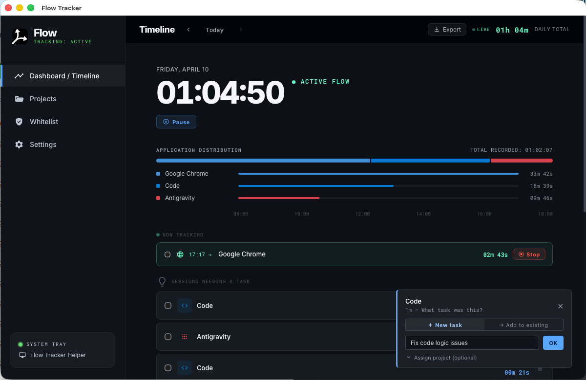

# ⚡️ Flow Tracker

<p align="center">
  <strong>Privacy-first, zero-effort desktop time tracking.</strong><br />
  Built with memory-safe <b>Rust</b> (Tauri) and modern <b>React/TypeScript</b>.
</p>

<p align="center">
  <a href="https://github.com/carmelodiventi/FlowTracker/releases">
    
  </a>
  <a href="https://github.com/carmelodiventi/FlowTracker/releases">
    
  </a>
  
</p>

---

**Flow Tracker** automatically records time on the apps you choose, keeps data 100% local, and helps you review your day without the friction of manual start/stop timers.

## 🚀 Status: Beta
The app is usable, but features and UX may change quickly. Occasional bugs are expected and bug reports are highly appreciated.

## 📦 Download
Prebuilt binaries are published on the [GitHub Releases](https://github.com/carmelodiventi/FlowTracker/releases) page:

1. Open the **Latest Release**.
2. Download the installer for your OS (`.dmg` for macOS, `.msi` or `.exe` for Windows).
3. Install and run.

---

## ✨ Why Flow Tracker?

- **Zero-effort**: Passive tracking based on active window focus.
- **Whitelist-based**: Monitor only the apps you care about (e.g., VS Code, Figma).
- **Local-first**: No cloud database. Your data never leaves your machine.
- **Lightweight**: Built on Tauri for a minimal memory footprint (< 50MB RAM).

## 📸 Screenshots


<p align="center"><i>Main dashboard with automatic timeline visualization</i></p>

---

## 🛠 Development & Structure

The repository is structured into two main parts:
1. **Landing Page**: Promotional website (Next.js 15).
2. **Desktop App**: Core application logic and desktop packaging (Tauri v2).

### Prerequisites
- **Node.js 20+** & **pnpm 9+**
- **Rust** (stable toolchain)
- [Tauri prerequisites](https://tauri.app/v1/guides/getting-started/prerequisites) for your specific OS.

### Local Setup (Landing Page)
```bash
pnpm install
pnpm dev
```

### Local Setup (Desktop App)
```bash
# Navigate to the app directory (if separate) and run Tauri dev
pnpm tauri dev
```

---

## 🍎 macOS Permissions (Important)
On macOS, window title tracking requires **Accessibility** permissions:

`System Settings -> Privacy & Security -> Accessibility -> Flow Tracker`

*Without this permission, the app can see process names but window titles (like document names or browser tabs) will remain hidden.*

## 🔒 Privacy by Design
- **No Cloud Sync**: All logs are stored in a local SQLite database.
- **No Telemetry**: No third-party tracking or data collection by default.
- **Open Source**: Audit the code yourself to see exactly how your data is handled.

---

## 🗺 Roadmap
- [ ] Smart Idle Detection.
- [ ] Timeline editing and manual adjustments.
- [ ] Weekly summary reports (optional/premium).
- [ ] Direct export to Notion, Linear, and Jira.

## 🤝 Contributing
Issues and Pull Requests are welcome! When reporting bugs, please include your OS version and steps to reproduce the issue.

---

<p align="center">
  Built with ❤️ by makers, for makers.
</p>
